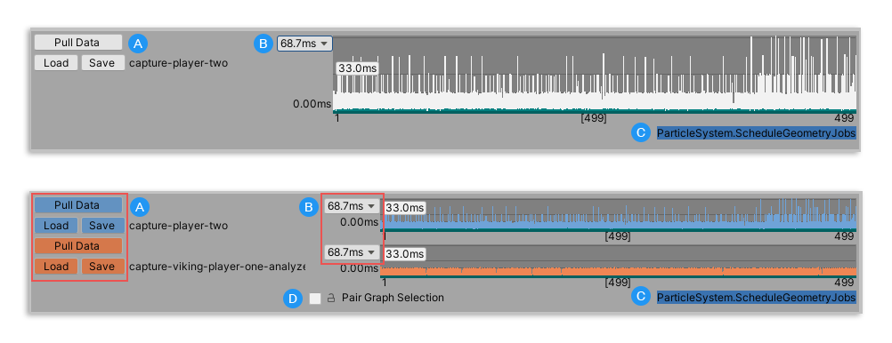
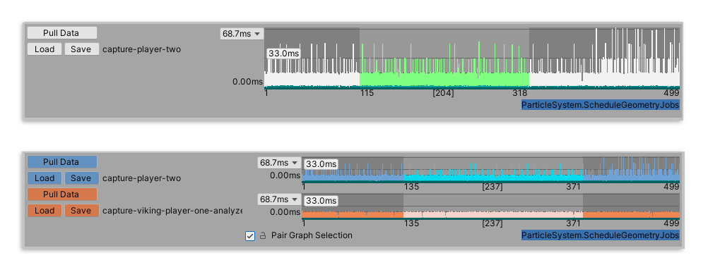
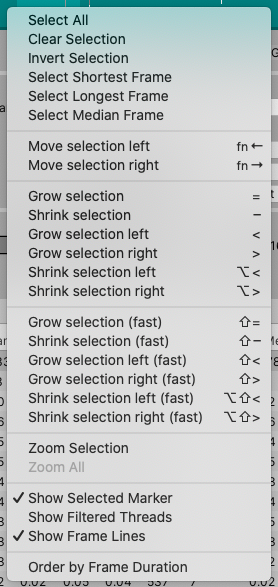

# Frame Control pane

You can use the **Frame Control** pane in both the [Single](single-view.md) and [Compare](compare-view.md) views  to select a range of frames to reduce the working set. The Frame Control pane is laid out as follows:

 *The Frame Control in the Single view (top), and in the Compare view (bottom)*

|**Control**|**Function**|
|---|---|
|**A:** Pull Data / Load / Save| Click the **Pull Data** button to pull any data that is loaded in the [Profiler](https://docs.unity3d.com/Manual/Profiler.html) window. Click the **Save** button to save the data as a .pdata file. Click the **Load** button to load a .pdata file. **Note:** You can only load a .pdata file. If you have data from the Profiler in the .data file format, open it in the Profiler first, and then select the **Pull Data** button in the Profile Analyzer.|
|**B:** Frame control scale| You can adjust the scale of the y-axis of the Frame Control graph by selecting this dropdown. By default, it scales to the maximum value of the data set. You can also choose from traditional frame boundaries. 16.67ms is equivalent to 60Hz/FPS, 33.33ms is equivalent to 30Hz/FPS, and  66.67ms is equivalent to 15Hz/FPS.|
|**C:** Selected thread| This displays the name of the marker which is selected in the **Marker Details** pane. When you select a thread from this list, the Profile Analyzer highlights its corresponding timings on the Frame Control graph in a green-blue color.|
|**D:** Pair Graph Selection *(Compare view only)*| When you enable this checkbox, the Profile Analyzer reflects any changes you make in the range selection of a data set in both data sets. This is important to ensure you compare the exact same number of frames in both data sets and get an accurate comparison. |

## Selecting a frame range

The Profile Analyzer uses all the frames in the data sets unless you select a sub-range. When you select a sub-range, it limits the analysis to just those frames which lets you focus on a specific frame or set of frames. To select a range of frames, click and drag on the Frame Control graph. To clear the selection, right click on the Frame Control graph and select **Clear Selection**.

To help visualize which frames are in the current selection, the start and end frame number, plus the frame count in square brackets appears on the x-axis of the graph.

 *The Frame Control in the Single view (top), with 204 frames selected, starting on frame 115 and ending on frame 318. The  Compare view (bottom) has Pair Graph Selection enabled, with the same 237 frames selected on both graphs, starting on frame 135 and ending on frame 371.*

## Frame range controls

You can control the selection of data in both the **Single** and **Compare** views by using the following shortcuts, or by right-clicking and selecting an option from the context menu.

>[!NOTE]
>In **Compare** view, make sure you enable the **Pair Graph Selection** checkbox to carry out the following commands on both graphs at the same time.

### Shortcuts

|**Shortcut**|**Function**|
|---|---|
|**Shift+click**|Hold down the Shift key while clicking on the selection on the Frame Control graph to move the selection around freely.|
|**Left/Right arrow**|Move the selection forward or backwards by one frame.|
|**Ctrl + click** (**Command + click** on macOS)| Selects multiple parts of the data set. Hold down the Ctrl key (Command key on macOS) while making a selection and then click, and optionally drag, on different sections of the chart to select multiple parts of the data set.|
|**Equals (=)**| Extend the selection by one frame on each end of the selection.|
|**Alt+Equals** (**&#8997; + Equals** on macOS)|Reduce the selection by one frame on each end of the selection.|
|**Shift+Equals**| Extend the selection by 10 frames on each end of the selection.|
|**Hyphen (-)**|Reduce the selection by one frame on each end of the selection.|
|**Alt+Hyphen** (**&#8997; + Hyphen** on macOS)|Extend the selection by one frame on each end of the selection.|
|**Shift+Hyphen**| Reduce the selection by 10 frames on each end of the selection.|
|**Comma (,)**| Extend the start of the selection by one frame.|
|**Alt+Comma** (**&#8997; + Comma**) on macOS|Reduce the start of the selection by one frame.|
|**Shift+Comma**|Extend the start of the selection by 10 frames.|
|**Period (.)**| Extend the end of the selection by one frame.|
|**Alt+Period** **(&#8997; + Period on macOS)**|Reduce the end of the selection by one frame.|
|**Shift+Period**|Extend the end of the selection by 10 frames.|

### Context menu commands

Right click on the Frame Control graph to bring up the context menu.

 *Frame Control context menu*

|**Menu item**|**Function**|
|---|---|
|**Clear Selection**|Clears the selected range. The Profile Analyzer then performs the analysis on the whole data set.|
|**Invert Selection**|Inverts the selected range.|
|**Select Shortest Frame**|Selects the frame with the shortest time.|
|**Select Longest Frame**|Selects the frame with the longest time.|
|**Select Median Frame**| Selects the frame with the Median time. |
|**Move selection left / right**|Move the whole selection one frame backwards, or one frame forwards. |
|**Grow selection**|Extend the selection by one frame on each end of the selection. Select the **(fast)** operation to extend the selection by 10 frames at each end.|
|**Shrink selection**|Reduce the selection by one frame on each end of the selection. Select the **(fast)** operation to reduce the selection by 10 frames at each end.|
|**Grow selection left / right**|Extend the start or the end of the selection by one frame. Select the **(fast)** operation to extend the start or the end of the selection by 10 frames.|
|**Shrink selection left /right**|Reduce the selection by one frame at the beginning or the end of the selection. Select the **(fast)** operation to reduce the start or the end of the selection by 10 frames.|
|**Zoom Selection**| Zoom the Frame Control graph to display the selected range only.|
|**Zoom All**| Zoom out to show all frames. The current selection range is highlighted.|
|**Show Selected Marker**| Enable this setting to highlight the selected marker's time on the Frame Control graph. By default, this setting is enabled and the Profile Analyzer highlights the marker's timings in green on the graph.|
|**Show Filtered Threads**|Enable this setting to highlight the current filtered thread times on the Frame Control graph. The Profile Analyzer highlights the timings in purple. This setting is disabled by default.|
|**Show Frame Lines**| Enable this setting to display the common frame boundaries as a horizontal line on the Frame Control graph. This setting is enabled by default.|
|**Order By Frame Duration**| Enable this setting to display the order of the frames by their duration from smallest to largest on the Frame Control graph, rather than by frame index. By default, this setting is disabled. This setting is particularly useful to group similar performant frames together.|
