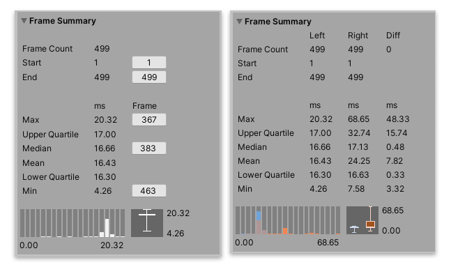

# Frame Summary

The Frame Summary pane displays a summary of the frame times for the range of data selected. This pane provides useful information about the frames in the data selection, including the maximum, minimum, upper and lower quartile, mean, and median timings.

 *The Frame Summary pane in Single view (left,) and Compare view (right)*

The Frame Summary pane is a good way for you to see at an overview what frames might be an outlier and how evenly distributed the timings are in the data set. For example, in the above screenshot, in the Compare view, while the median values are fairly similar, with little difference, the maximum frame value differs greatly, which suggests that the Right data set had more spikes in performance, that you could focus investigating further.

## Statistics

|**Statistic**|**Description**|
|---|---|
|**Frame Count**|The number of frames selected in the [Frame Control pane](frame-range-selection.md).  In Compare view, the **Left** count corresponds to the first data set loaded into the Profile Analyzer, colored blue, and the **Right** count corresponds to the second data set loaded into the Profile Analyzer, colored orange.   The **Diff** count is the difference in frame count between the Right and Left values. When this number is negative, it indicates that the Left frame count is larger than the Right frame count. When the Diff is a positive number, it means that the Right frame count is larger than the Left frame count.|
|**Start**|The frame number that the data selection starts on. In Single view, you can click the button next to this number to jump to the relevant frame in the Profiler window.|
|**End**|The frame number that the data selection ends on. In Single view, you can click the button next to this number to jump to the relevant frame in the Profiler window.|
|**Max**|The largest (maximum) frame time in the data selection. In Compare view, the Diff column shows the difference between the Right and Left timings.|
|**Upper Quartile**|Displays the upper [quartile](https://en.wikipedia.org/wiki/Quartile) of the data set. In Compare view, the Diff column shows the difference between the Right and Left timings.|
|**Median**|Displays the [median](https://en.wikipedia.org/wiki/Median) value of the data set. In Compare view, the Diff column shows the difference between the Right and Left timings.|
|**Mean**|Displays the [mean](https://en.wikipedia.org/wiki/Arithmetic_mean) value of the data set. In Compare view, the Diff column shows the difference between the Right and Left timings.|
|**Lower Quartile**|Displays the lower [quartile](https://en.wikipedia.org/wiki/Quartile) of the data set. In Compare view, the Diff column shows the difference between the Right and Left timings.|
|**Min**|The smallest (minimum) frame time in the data selection. In Compare view, the Diff column shows the difference between the Right and Left timings.|

Underneath the statistics, the Profile Analyzer displays the timings as a histogram and box and whisker plot. For further information on the statistics available and how to analyze them, see the documentation on [Statistics in the Profile Analyzer](statistics.md).
